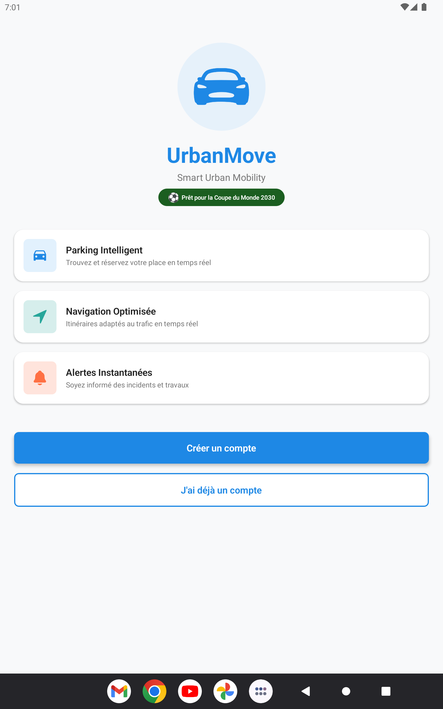

# 🚗 UrbanMove - Smart Urban Mobility

<p align="center">
  
</p>

> **Note:** This repository is documented in English for professional visibility, but the mobile application's user interface is currently in **French**.

A smart urban mobility mobile application designed to improve traffic flow and parking management in major Moroccan cities (Rabat, Casablanca, Tangier).

## 📱 Features

### Smart Parking
- Find nearby parking lots on the map
- Real-time availability tracking
- Online reservation and secure payment
- Turn-by-turn navigation to the parking spot

### Smart Navigation
- Optimized route calculation
- Smart traffic light integration
- Time and CO2 emission savings
- Turn-by-turn driving instructions

### Real-time Alerts
- Accidents and incidents reporting
- Roadwork notifications
- Special events tracking
- Live traffic conditions

### User Profile
- Personal vehicle management
- Electronic wallet for payments
- Reservation history
- Personal mobility statistics

## 🛠️ Technical Stack

### Frontend (Mobile App)
- **React Native** + **Expo SDK 50**
- React Navigation 6.x
- react-native-maps
- expo-location
- Axios

### Backend (REST API)
- **Node.js** + **Express 4.x**
- **MongoDB** + **Mongoose 8.x**
- JWT Authentication
- Geospatial Queries

## 📁 Project Structure

```text
frproject/
├── UrbanMove/                 # React Native Mobile Application
│   ├── src/
│   │   ├── screens/          # App screens
│   │   ├── navigation/       # Navigation configuration
│   │   ├── services/         # API services
│   │   ├── context/          # Context providers
│   │   └── constants/        # Theme & configs
│   ├── App.js
│   └── package.json
│
└── UrbanMove-Backend/         # Node.js REST API
    ├── src/
    │   ├── models/           # Mongoose models
    │   ├── routes/           # Express routes
    │   ├── middleware/       # Custom middlewares
    │   └── seeds/            # Demo data seeders
    ├── .env
    └── package.json
```

## 🚀 Installation & Setup

### Prerequisites
- Node.js 18+ 
- MongoDB (Local or Atlas)
- Expo CLI (`npm install -g expo-cli`)

### Backend Setup

```bash
# Navigate to the backend directory
cd UrbanMove-Backend

# Install dependencies
npm install

# Configure environment variables
# Edit the .env file with your specific configurations

# Start MongoDB (if using local instance)
mongod

# Seed the database with demo data (Optional)
npm run seed

# Start the server
npm run dev
```

The server will start on `http://localhost:5000`

### Frontend Setup

```bash
# Navigate to the frontend directory
cd UrbanMove

# Install dependencies
npm install

# Start Expo development server
npx expo start
```

Scan the QR code with the Expo Go app on your phone to launch the app.

## 📡 API Endpoints

### Authentication
- `POST /api/auth/register` - User registration
- `POST /api/auth/login` - User login
- `GET /api/auth/profile` - Get user profile
- `POST /api/auth/logout` - User logout

### Parking
- `GET /api/parking` - List all parking lots
- `GET /api/parking/nearby?lat=&lng=` - Find nearby parking
- `GET /api/parking/:id` - Get parking details
- `POST /api/parking/:id/reserve` - Reserve a spot
- `GET /api/parking/reservations/my` - My reservations

### Navigation
- `POST /api/navigation/route` - Calculate route
- `GET /api/navigation/traffic` - Traffic status
- `GET /api/navigation/smart-lights` - Smart traffic lights

### Alerts
- `GET /api/alerts` - List all alerts
- `GET /api/alerts/nearby?lat=&lng=` - Nearby alerts
- `POST /api/alerts` - Report an alert
- `PUT /api/alerts/:id/confirm` - Confirm an alert

### User
- `GET /api/user/profile` - Full profile details
- `PUT /api/user/profile` - Update profile
- `GET /api/user/vehicles` - My vehicles
- `POST /api/user/vehicles` - Add a vehicle
- `GET /api/user/wallet` - My wallet balance
- `POST /api/user/wallet/topup` - Top up wallet

## 🔐 Demo Credentials

After running the database seed, you can log in using:

- **Email**: demo@urbanmove.ma
- **Password**: demo123456

## 🏙️ Supported Cities

| City | Parking Lots | Smart Traffic Lights |
|-------|----------|-------------------|
| Rabat | 3 | 3 |
| Casablanca | 3 | 3 |
| Tangier | 2 | 2 |

## 📄 License

This project was developed for educational purposes.

---

**UrbanMove** - Simplifying urban mobility in Morocco 🇲🇦
